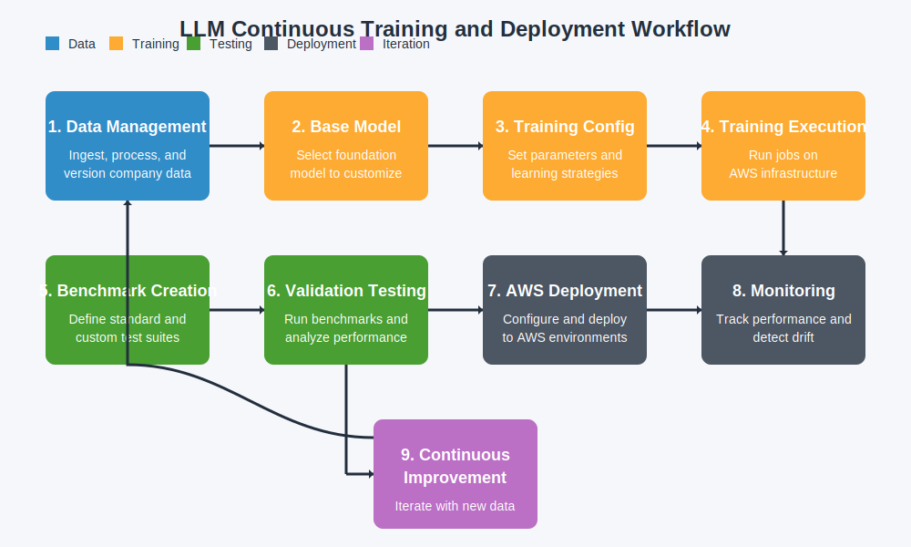
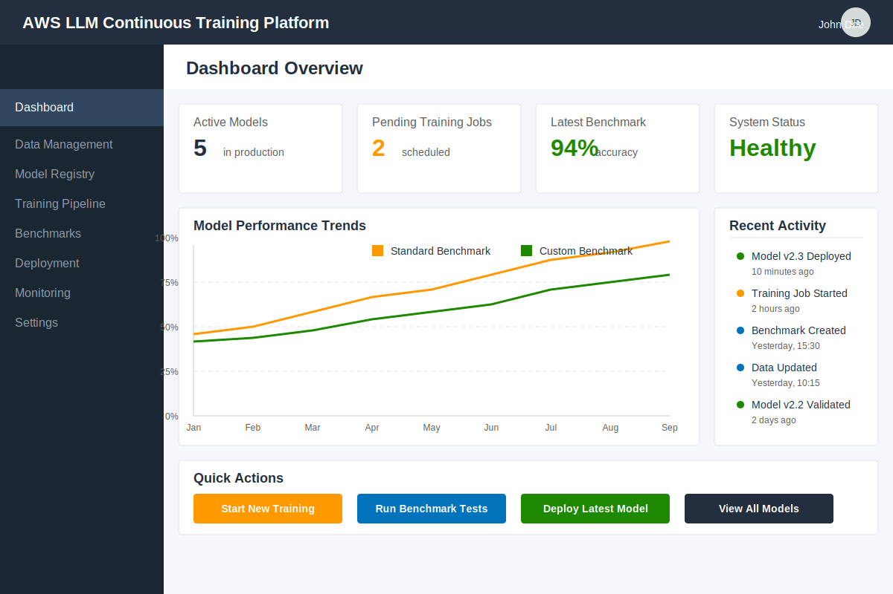
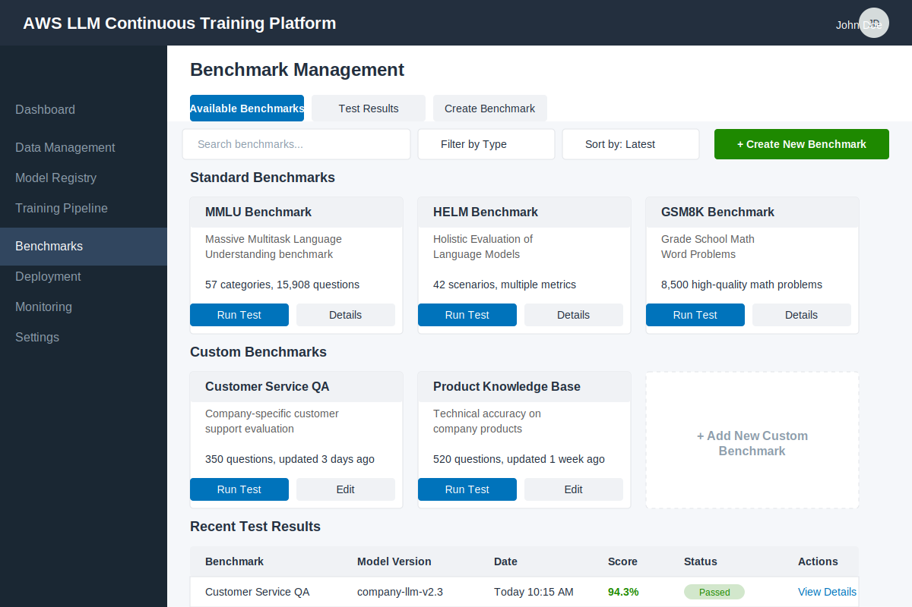
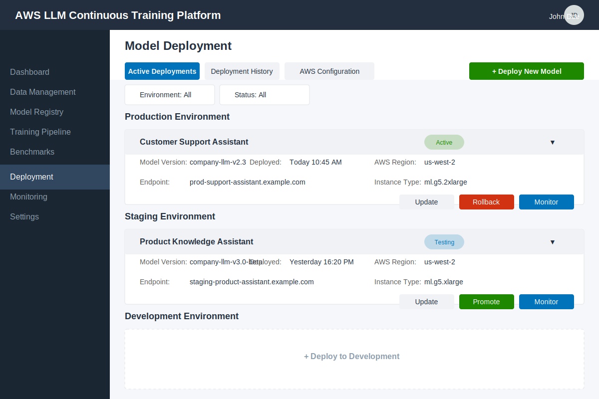

# AWS LLM Continuous Training & Deployment Platform

This repository contains design documents and mockups for an AWS-based platform that enables companies to customize, continuously train, and deploy language models according to their specific needs.

## Platform Overview

The platform allows companies to:
- Customize language models according to their specific needs
- Run tests against standardized benchmarks to ensure model quality
- Create and use custom benchmarks specific to the company
- Support continuous retraining when new information becomes available
- Deploy and manage these models in AWS infrastructure

## System Architecture

The platform is built around several key components:

1. **Data Management** - Ingest, process and version company data
2. **Model Registry** - Store all model versions with comprehensive metadata
3. **Training Pipeline** - Configure and run training jobs on AWS infrastructure
4. **Benchmark Testing** - Create and run standard/custom benchmarks
5. **Deployment Management** - Configure and deploy to AWS environments
6. **Monitoring** - Track performance and detect drift

## User Workflows

The platform supports various user workflows:

1. **Initial Platform Setup** - AWS integration and team configuration
2. **Model Customization** - Base model selection, data preparation, training configuration
3. **Benchmark Testing** - Standard benchmark selection, custom benchmark creation, running tests
4. **Model Deployment** - Configuration, execution, and post-deployment management
5. **Continuous Improvement** - Data updates, incremental training, validation and deployment
6. **Emergency Response** - Alert detection, immediate response, root cause analysis

## Interface Mockups

### Workflow Diagram

### Dashboard Interface

### Benchmark Management

### Deployment Management

## Implementation Plan

The project will be implemented in phases:

1. **Foundation** (Months 1-3) - Core UI, model registry, AWS deployment pipeline, standard benchmarking
2. **Advanced Features** (Months 4-6) - Custom benchmarks, continuous training, AWS optimization, monitoring
3. **Enterprise Readiness** (Months 7-9) - Multi-user support, advanced safety features, audit trails
4. **Expansion** (Months 10-12) - Multiple model architectures, drift detection, third-party integrations

## Getting Started

This repository currently contains design documents. Implementation will begin soon. 